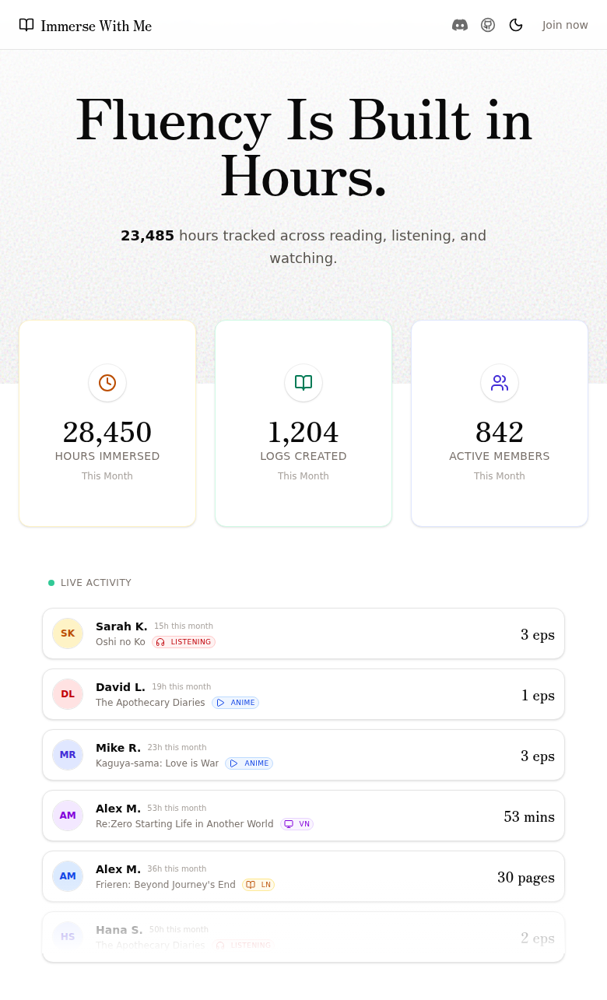
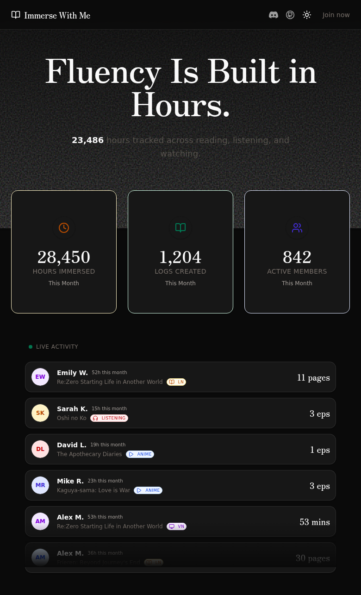
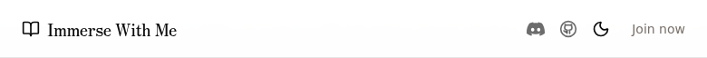
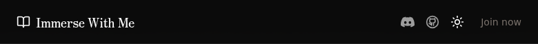

## Automated PR Review

  

> [!WARNING]
> **Incomplete dark mode implementation** — Several text colors remain hardcoded to light-mode-only values (`text-stone-500`, `text-stone-600`, `text-stone-400`) and will have poor contrast/readability in dark mode. The theme toggle works, but the page isn't fully dark-mode-ready.

> [!CAUTION]
> **HTML nesting violation causing React console errors** — The `AnimatedCounter` component renders `<div>` elements inside a `<p>` tag (line 250–253 of `home.tsx`), which is invalid HTML. This causes two React console errors on every page load:
> ```
> In HTML, <div> cannot be a descendant of <p>.
> This will cause a hydration error.
> ```
> This is a pre-existing issue (not introduced by this PR), but it should be addressed. Fix by changing the `<p>` to a `<div>` or changing the `<div>` in `Digit` to a `<span>`:
> ```diff
> - <div className="relative inline-grid place-items-center overflow-hidden">
> + <span className="relative inline-grid place-items-center overflow-hidden">
>     <span className="invisible col-start-1 row-start-1">{char}</span>
>     ...
> - </div>
> + </span>
> ```
> [`home.tsx#L380`](https://github.com/ForeverAnApple/immerse-with-me/blob/a427ea481c94b459064267c7e8ad07b257432c3b/src/pages/home.tsx#L380)

<details>
<summary><strong>All issues (7 total)</strong></summary>

| Sev | Issue | Location | Details |
|:---:|-------|----------|---------|
| 🔴 | `<div>` nested inside `<p>` causes React hydration errors | [`home.tsx#L380`](https://github.com/ForeverAnApple/immerse-with-me/blob/a427ea481c94b459064267c7e8ad07b257432c3b/src/pages/home.tsx#L380) | Pre-existing. `AnimatedCounter` renders `<div>` inside `<p>`. Change `<div>` to `<span>` in `Digit` component. |
| 🟠 | Hardcoded `text-stone-600` on subtitle doesn't adapt to dark mode | [`home.tsx#L250`](https://github.com/ForeverAnApple/immerse-with-me/blob/a427ea481c94b459064267c7e8ad07b257432c3b/src/pages/home.tsx#L250) | `text-stone-600` stays dark gray in dark mode — low contrast against dark background. Should use `text-muted-foreground` or add `dark:text-stone-400`. |
| 🟠 | Hardcoded `text-stone-500` on stat labels and other elements | [`home.tsx#L273-L276`](https://github.com/ForeverAnApple/immerse-with-me/blob/a427ea481c94b459064267c7e8ad07b257432c3b/src/pages/home.tsx#L273) | Multiple instances of `text-stone-500` and `text-stone-400` that don't adapt to dark mode. Should use `text-muted-foreground`. |
| 🟡 | Redundant `dark:` class overrides alongside theme-aware classes | [`home.tsx#L201`](https://github.com/ForeverAnApple/immerse-with-me/blob/a427ea481c94b459064267c7e8ad07b257432c3b/src/pages/home.tsx#L201) | `text-foreground/60` already resolves correctly in dark mode via CSS variables. The additional `dark:text-white/60 dark:hover:text-white` is redundant and adds maintenance burden. |
| 🟡 | `hover:border-border` is a no-op | [`home.tsx#L314`](https://github.com/ForeverAnApple/immerse-with-me/blob/a427ea481c94b459064267c7e8ad07b257432c3b/src/pages/home.tsx#L314) | The base class is already `border-border`, so `hover:border-border` changes nothing. Should be removed or changed to a different hover border color. |
| 🟡 | `ring-black/5` doesn't adapt to dark mode | [`home.tsx#L267`](https://github.com/ForeverAnApple/immerse-with-me/blob/a427ea481c94b459064267c7e8ad07b257432c3b/src/pages/home.tsx#L267) | Hardcoded `ring-black/5` is invisible against dark backgrounds. Consider `ring-border` or `ring-foreground/5`. |
| 🟢 | Missing newline at end of `main.tsx` | [`main.tsx#L40`](https://github.com/ForeverAnApple/immerse-with-me/blob/a427ea481c94b459064267c7e8ad07b257432c3b/src/main.tsx#L40) | File ends with trailing whitespace instead of a newline. Minor style issue. |

</details>

<details>
<summary><strong>What the PR does well</strong></summary>

- ✅ Correctly wraps the app in `ThemeProvider` from `next-themes` with sensible defaults (`defaultTheme="light"`, `enableSystem={false}`)
- ✅ Replaces hardcoded background/foreground colors (`#FAFAF7`, `#1A1A1A`, `#1F2A44`) with theme-aware CSS variables (`bg-background`, `text-foreground`, `border-border`, `bg-card`)
- ✅ Theme toggle button is properly placed in the header with correct `aria-label`
- ✅ Icon swaps correctly between `Sun` and `Moon` based on current theme
- ✅ `next-themes` is already in `package.json` dependencies — no missing dependency
- ✅ TypeScript compiles cleanly with zero errors
- ✅ Dark mode CSS variables are properly defined in `index.css` with OKLCH colors

</details>

<details>
<summary><strong>Static Analysis</strong></summary>

| Check | Result |
|-------|--------|
| TypeScript (`tsc --noEmit`) | ✅ Pass — zero errors |
| Runtime console | ⚠️ 2 errors (pre-existing HTML nesting issue) |
| Dependencies | ✅ `next-themes@0.4.6` installed |

</details>

### UI Verification

<details>
<summary><strong>Light Mode (default)</strong></summary>



Light mode renders correctly. The theme toggle shows a moon icon (indicating click will switch to dark). All text is readable against the light background.

</details>

<details>
<summary><strong>Dark Mode (after toggle)</strong></summary>



Dark mode activates correctly when clicking the toggle. Background, cards, and primary text all adapt properly. Note: secondary text (`text-stone-500`, `text-stone-600`) has reduced contrast in dark mode — these hardcoded colors weren't updated in this PR.

</details>

<details>
<summary><strong>Header — Theme Toggle Button</strong></summary>

<table>
<tr>
<td align="center"><strong>Light Mode</strong></td>
<td align="center"><strong>Dark Mode</strong></td>
</tr>
<tr>
<td></td>
<td></td>
</tr>
</table>

The toggle button sits alongside Discord and GitHub icons in the header. Icon correctly switches between Moon (light mode) and Sun (dark mode).

</details>

### Summary

This PR successfully adds a dark/light theme toggle using `next-themes`. The core implementation is solid — `ThemeProvider` wrapping, CSS variable usage for primary colors, and the toggle UI all work correctly. However, the dark mode implementation is **incomplete**: several secondary text colors (`text-stone-*`) and decorative elements (`ring-black/5`) remain hardcoded to light-mode values, resulting in reduced contrast in dark mode. These should be converted to theme-aware equivalents (`text-muted-foreground`, `ring-border`, etc.) for a polished dark mode experience.

**Recommendation**: Approve with suggestions — the core feature works, but a follow-up pass to convert remaining hardcoded colors would make dark mode production-ready.
